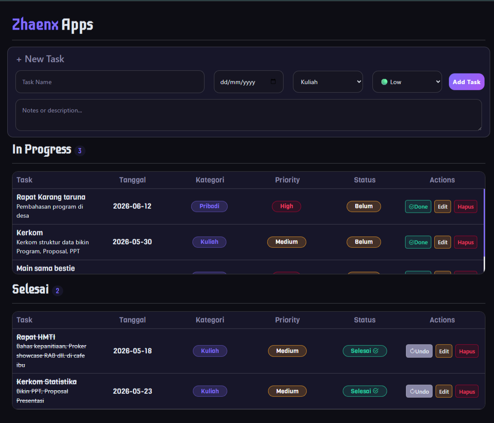

# To Do List App

Aplikasi To Do List berbasis web yang dibuat menggunakan ReactJS dan ViteJS dengan penerapan Array 1 Dimensi dan Array 2 Dimensi sebagai struktur penyimpanan data. Aplikasi ini memungkinkan pengguna untuk mengelola tugas sehari-hari secara lebih terorganisir melalui fitur CRUD, kategori dinamis, prioritas tugas, deadline, dan penyimpanan data menggunakan Local Storage.

## Fitur

- Tambah Task
- Edit Task menggunakan Modal
- Hapus Task dengan Modal Konfirmasi
- Kategori Dinamis
- Priority Task (Low, Medium, High)
- Deadline Task
- Status Selesai dan Belum Selesai
- Penyimpanan Data dengan Local Storage
- Responsive User Interface

## Struktur Data

## Preview




### Array 1 Dimensi

Digunakan untuk menyimpan daftar kategori.

```javascript
["Kuliah", "Kerja", "Pribadi"];
```

### Array 2 Dimensi

Digunakan untuk menyimpan data task.

```javascript
[[id, namaTask, deskripsi, tanggal, kategori, priority, status]];
```

Keterangan:

| Index | Data      |
| ----- | --------- |
| 0     | ID        |
| 1     | Nama Task |
| 2     | Deskripsi |
| 3     | Deadline  |
| 4     | Kategori  |
| 5     | Priority  |
| 6     | Status    |

## Teknologi yang Digunakan

- ReactJS
- ViteJS
- JavaScript (ES6+)
- CSS3
- Local Storage

## Instalasi

Clone repository:

```bash
git clone https://github.com/R-Mahendra/Array-Project.git
```

Masuk ke folder project:

```bash
cd Array-Project
```

Install dependency:

```bash
npm install
```

Jalankan project:

```bash
npm run dev
```

Build project:

```bash
npm run build
```

## Struktur Folder

```bash
src/
│
├── components/
│   ├── TaskForm.jsx
│   ├── TaskList.jsx
│   ├── EditModal.jsx
│   └── DeleteModal.jsx
│
├── hooks/
│   └── useModalClose.js
│
├── App.jsx
├── main.jsx
└── index.css
```

## Implementasi CRUD

### Create

Menambahkan task baru ke dalam Array 2 Dimensi.

### Read

Menampilkan seluruh task yang tersimpan.

### Update

Mengubah data task melalui modal edit.

### Delete

Menghapus task melalui modal konfirmasi.

## Penyimpanan Data

Data task dan kategori disimpan menggunakan Local Storage sehingga data tetap tersedia meskipun browser ditutup atau halaman direfresh.

```javascript
localStorage.setItem("tasks", JSON.stringify(tasks));
localStorage.setItem("kategoriList", JSON.stringify(kategoriList));
```

## Screenshot

### Halaman Utama

Tambahkan screenshot aplikasi di sini.

### Modal Edit

Tambahkan screenshot modal edit di sini.

### Modal Hapus

Tambahkan screenshot modal hapus di sini.

### Local Storage

Tambahkan screenshot data Local Storage di sini.

## Tujuan Pembelajaran

Project ini dibuat untuk memenuhi tugas mata kuliah Struktur Data dengan tujuan:

- Memahami implementasi Array 1 Dimensi.
- Memahami implementasi Array 2 Dimensi.
- Menerapkan operasi CRUD.
- Menggunakan Local Storage pada aplikasi web.
- Mengembangkan aplikasi menggunakan ReactJS dan ViteJS.

## Tim Pengembang

- Aisyah Nurwahyu Khoirunnisa
- Denisa Zahra Benita
- Muhammad Afif Zulfanshar
- Reza Mahendra
- Rifqy Ardian Adinata

## Lisensi

Project ini dibuat untuk keperluan pembelajaran dan tugas mata kuliah Struktur Data.
